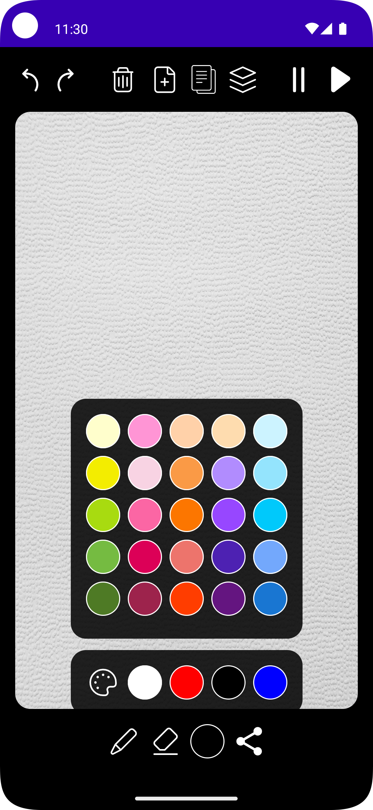
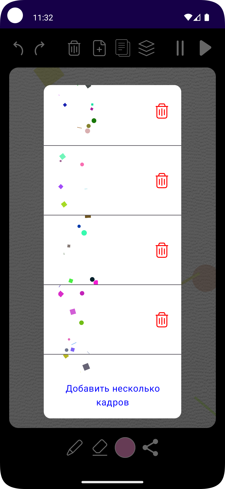
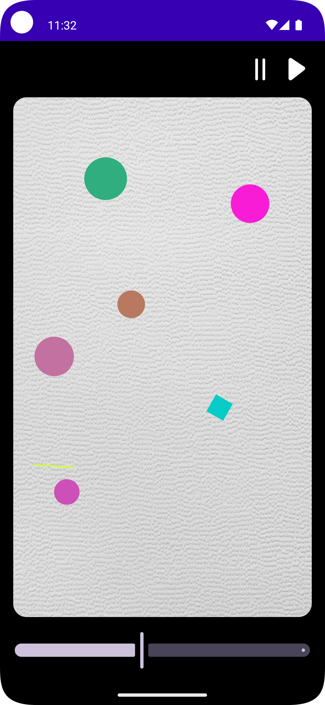

# Живые картинки. Yandex Cup 2024

* ✅ Контроль изменения цвета рисования с возможностью выбора как минимум из 3 разных цветов

* ✅ Кнопки отмены и возврата последнего действия
* ✅ Кнопку создания следующего кадра
* ✅ Кнопку удаления текущего кадра
* ✅ Запуск и остановку воспроизведения анимации
* ✅ Генерация и добавление N случайных кадров
* ✅ Панель либо экран с раскадровкой для переключения между добавленными кадрами.
* ✅ Кнопка дублирования кадра 
* ✅ Возможность удаления всех кадров сразу.(При удерживании кнопки удаления кадра)
* ✅ Настройка скорости воспроизведения анимации
* ✅ Экспорт анимации в GIF с возможностью поделиться файлом
* ❌ Выбор кастомного любого цвета рисования из RGB-палитры.
* ❌ Инструмент вставки готовых геометрических фигур
* ✅ Изменение толщины карандаша и ластика (При удержании кнопки карандаша или ластика и перемещении вправо-влево)
* ✅ Реализация стека действий для многократной отмены или возврата.
* ❌ Увеличение холста при помощи жеста pinch-to-zoom для точной прорисовки деталей изображения.
* ✅ Иконка приложения.
* ✅ Полноценная поддержка светлой и тёмной тем

  
  
  

